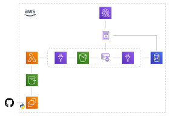

# Data Engineer - Modelo de um pipeline de dados

### 1. Introdução

Grande parte das empresas produzem dados das mais variadas formas e com diferentes finalidades. Atualmente com advento da internet e do crescimento do poder computacional, a quantidade de dados gerados cresce de uma forma exponencial. Além disso, os dados não são mais vistos como apenas informações que guardam o histórico operacional de uma empresa. Os dados tem um papel fundamental para tomada de decisões atráves da análise e de modelos preditivos. Por isso, é fundamental gerar valor dos dados. Isso permite as empresas terem mais poder de decisão e competitividade no mercado.

Para armazenamento de dados, grande parte das empresas utilizam bancos de dados relacionais. Os bancos de dados relacionais podem ser utilizados em um modelo transacional ou *Data Warehousing*. O modelo transacional consiste no em processos transacionais de um determinado negócio. Basicamente, esse modelo de banco de dados é usado pra registrar todo o histórico de transação de uma empresa. Esse modelo é conhecido como Processamento de Transações em Tempo Real (OLTP ou *Online Transaction Processing*, do inglês).

O *Data Warehouse* (DWs) segue um modelo de Processamento Analítico em Tempo Real (OLAP ou *Online Analytical Processing*, do inglês). Esse modelo é usado para armazenar uma grande quantidade de informações históricas, através de uma modelagem que permite executar operações complexas de forma rápida.

Há ainda um outro componente que é o *Data Mart* (DM). O DM é basicamente um DW com um grau maior de granularidade para atender a um determinado projeto ou time. Desse modo, é possível realizar acessos frequentes de forma rápida e sem a necessidade de realizar operações complexas, pois o modelo dimensional dos dados é simplificado.

Um dos problemas desses tipos de abordagem é a quantidade e a variação dos dados que são produzidos atualmente. Os bancos de dados do modelo relacional organizam os dados de forma estruturada, através de um estilo colunar. Nesses modelos, também é possível armazenar dados semi-estruturados (json e xml) e não-estruturados (audio, vídeo e imagens), porém requer uma modelagem que pode trazer uma grande complexidade para o banco de dados.

Para armazenar qualquer tipo de dado, independentemente da estrutura, surgiram os *Data Lakes* (DL). O DL é um grande repositório de objetos para armazenar qualquer tipo de informação. Esse modelo é dividido em camadas, onde os dados são transferidos de uma para outra, através de processos de sanitização, refinamento e remodelagem. Uma abordagem bem comum é um DL com três camada, sendo a primeira chamada de *raw*, onde os dados são inseridos de forma bruta. A segunda camada é a *trusted*, responsável por aplicar técnicas de sanitização e transformações nos dados. Finalmente, a camada *refined* é onde os dados já estão limpos e preparados para serem consumidos pelos clientes.

A Olist é uma plataforma que faz a ligação e promove a experiência entre vendedores e as lojas que oferecem o serviço de *marketplace*. A plataforma possui uma grande quantidade de dados que são transitados como informações de vendedores, compradores, transações, avaliações, entre outros.

Esse trabalho tem por objetivo mostrar um *pipeline* de dados que foi implementado utilizando o *dataset* da Olist. A finalidade desse trabalho é implementar o [desafio](https://github.com/olist/work-at-olist-data) para a vaga para de *Data Engineer*, que é o profissional responsável por criar e monitorar esse *pipeline*.

### 2. Arquitetura

A visão geral da arquitetura consiste em DL contendo as três camadas. O primeiro componente da arquitetura é um processo que realizar o download e a transfência dos dados para o data lake. As operações e transferência os dados através das camadas é realizada por um orquestrador de *pipeline* de dados. Outro componente da arquitetura é um catálogo dos dados com o objetivo de visualizar de que forma as informações estão estruturadas. Finalmente, o último componente da solução é um DM que foi criado com o objetivo de mostrar as vendas realizada.

A arquitetura da solução pode ser vista na Figura 1. O primeiro passo é realizar o download dos arquivos do GitHub. Para isso é utilizado uma instância do Amazon EC2. Essa instância possui um [script Python](/etl-jobs/extractor.py) que faz o download e faz o envio para um *bucket* no Amazon S3 que representa a camada *raw* do DL.



O *bucket raw* possui um evento que dispara uma [função do Amazon Lambda](/start-workflow), uma vez que o upload para o *raw* é finalizado. Essa função tem por objetivo executar o ETL, que é orquestrado pelo Workflow do serviço Glue. 

O *dataset* de *reviews* dos usuários possui uma coluna onde há textos com vírgulas, que é o mesmo caractere utilizado como separador das colunas. Isso estava provocando um deslocamento dos dados, a partir de uma vírgula do texto. Para formatar as colunas da forma correta, o primeiro processo do workflow do Glue é [um Job](/etl-jobs/transformations.py) que realiza essa correção. Além disso, o mesmo Job faz uma pequena correção no nome de uma coluna do *dataset* de produtos. Finalmente, os arquivos são convertidos para o formato parquet e salvos em outro *bucket* que representa a camada *trusted* do DL.

O segundo componente do *Workflow* é um *Crawler* do Glue para extrair os metadados dos arquivos e criar o catálogo dos dos, que por sua vez são acessados disponibilizados no Amazon Athena. O Amazon Athena é um serviço que disponibiliza uma interface para consultas dos dados no S3 utilizando SQL.

O último processo do *Workflow* é [um Job](/etl-jobs/load_redshift.py) que cria a estrutura e carrega os dados no Redshift, que é um DM de vendas e representa a camada *trusted* do DL. A primeira operação do Job é criar (se não existe) dois schemas, um externo para consultar os dados da *refined* através do catálogo, e o outro é o schema que segue um modelo dimensional das vendas e tem o objetivo de servir os clientes do *pipeline*.

As dimensões do modelo são o *time*, *date*, *customer*, *location*, *product* e *seller* e as tabelas são criadas pelo Job, caso não existam. O último passo do Job é transferir os dados da estrutura relacional da camada *trusted* para a estrutura dimensional da camada *trusted*.

### 3. Subir o data pipeline

Para provisionar os recursos necessários para o data pipeline na nuvem da AWS é necessário seguir os seguintes passos:
 - No serviço VPC, criar um Endpoint para o serviço Amazon S3, informando a VPC e a Route Table que realiza as rotas das subnets contidas na VPC;
 - Criar ou utilizar um *bucket* existente do S3 para armazenamento dos scripts necessários para rodar o pipeline;
 - Executar o script [build-deploy.sh](build-deploy.sh) informando o *bucket* dos scripts, uma subnet da VPC padrão, o *Security Group* padrão e uma *Availability Zone*. Exemplo:
 
```$ bash build-deploy.sh olist-challenge-deployments subnet-xxxxxxxx sg-xxxxxxxx us-east-1a```

> O pipeline só está disponível para a região North Virginia (us-east-1)